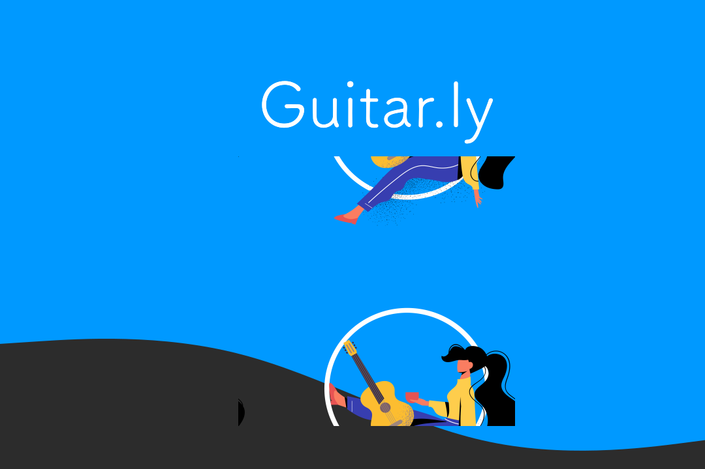

<h1 align="center">
  
</h1>

  

  

    

  <a href="#key-features">Key Features</a> •
  <a href="#howto">How To Use</a> •
  <a href="#demo">Demo</a>

  
<h1>Check out the live demo at <a href="https://guitarly.vercel.app/">guitarly.vercel.app</a></h1>

## License
